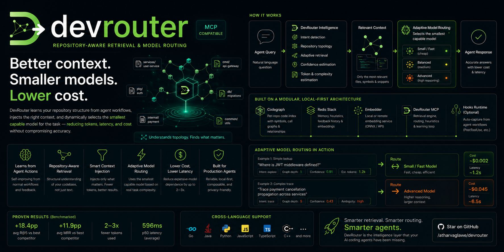

# DevRouter

Repository-aware retrieval and model routing for AI coding agents.

DevRouter learns repository structure from agent workflows and injects the right context into the smallest capable model — improving trace, debug, and exploration tasks with fewer tokens and minimal operational overhead.

<p align="center">
  
</p>

MCP server that returns structured, memory-augmented repository context for
agent coding. What it gives you:

- **Persistent shared memory** — agents save notes about files, functions,
  flows, and design decisions. Stored in Redis and searched by meaning, so
  the next agent (or the next developer) gets the same context.
- **Symbol & call-chain intelligence** — for any query, devrouter pulls the
  relevant symbols, who calls them, who they call, and the code snippets
  around them, from a per-repo code index.
- **Intent-aware responses** — devrouter classifies each query (debug,
  explore, trace, refactor, general) and shapes the response accordingly:
  how far to walk the call graph, how much code to include, what to trim.
- **Relevance filtering** — memories are filtered and re-ranked before
  they reach the response. Things that only loosely match the query get
  dropped instead of padding the prompt.
- **Self-tuning** — every response is paired with a feedback event from the
  agent (how many extra files it had to read, whether the answer worked).
  devrouter uses this to slowly improve which files and snippets it picks
  for similar queries, and to suppress memories that keep matching queries
  they don't actually help.
- **Truthful confidence scores** — every similarity and confidence number
  in the response is computed from the actual match, not a hardcoded value
  per source type.

## Dashboard

A read-only observability dashboard ships on by default at
[http://127.0.0.1:8088](http://127.0.0.1:8088) whenever devrouter is
running — live queries with cascading repo / topic / intent filters,
heuristic profile drift, decision lineage, and saved flows rendered
as deep call-chain graphs (1–5 hops, configurable per flow) sourced
from the codegraph snapshot. Tour on the `goserving` benchmark repo:

<p align="center">
  <video src="docs/assets/devrouter-goserving.mp4" width="900" autoplay loop muted playsinline></video>
</p>

Port and shutoff knobs in
[`docs/configuration.md#dashboard`](docs/configuration.md#dashboard).

## Prerequisites

Go ≥ 1.21, Node.js ≥ 20, Redis Stack (with the RediSearch module), Docker.

## Installation

### 1. Build, start, index

```bash
git clone <this-repo> devrouter && cd devrouter

make all                                                # build ./devrouter + compile codegraph
make up                                                 # start Redis + embedder container + codegraph (idempotent)
make status                                             # verify all services are PONG

./devrouter analyze --embeddings /abs/path/to/your-repo # index each repo (required; re-run on major refactors)
```

`--embeddings` builds a local HNSW vector index over symbol content
for semantic fallback retrieval — adds ~2–5× to index time per file,
no extra cost at query time, and worth keeping on for any repo larger
than a few hundred files. It needs no API keys; embeddings are
generated locally by the bundled ONNX runner. Drop the flag if you
want BM25 + graph only.

### 2. Wire it into your agent

Drop devrouter into your MCP host's config, pointing `command` at the
absolute path of the binary built in step 1. For Cursor that's
`.cursor/mcp.json` (project-level) or `~/.cursor/mcp.json` (global); the
same shape works for Claude Code (`~/.claude/mcp.json`), Codex CLI, and
other MCP hosts:

```json
{
  "mcpServers": {
    "devrouter": {
      "command": "/abs/path/to/devrouter",
      "args": [],
      "env": {
        "DEVROUTER_REDIS": "localhost:6379"
      }
    }
  }
}
```

All env vars (custom embedder backend, self-tuning toggles, etc.) are
documented in [`docs/configuration.md`](docs/configuration.md).

### 3. Install the agent ruleset (required)

Copy the canonical block from [`docs/agent-rules.md`](docs/agent-rules.md)
into your repo's agent context file (`CLAUDE.md` /
`.cursor/rules/devrouter.mdc` / `AGENTS.md`) and replace `<repo>` with the
name you indexed in step 1. devrouter's self-tuning only works if the
agent follows the three rules in that file — `docs/agent-rules.md` explains
each rule, what breaks if you skip it, and the order in which the agent
must call the tools.

## Tools

devrouter exposes twelve MCP tools, grouped by purpose:

- **Read:** `dev_context`, `retrieve_debug`
- **Write (memory):** `memory_save_file`, `memory_save_func`, `memory_save_flow`, `memory_populate`
- **Write (decisions):** `decision_save`, `decision_list`, `decision_supersede`
- **Feedback & tuning:** `dev_feedback`, `dev_feedback_stats`, `dev_heuristics_reset`

Per-tool input schemas, return shapes, and usage notes live in
[`docs/tools.md`](docs/tools.md). For the call-order rules agents must
follow, see [`docs/agent-rules.md`](docs/agent-rules.md).

## Benchmarks

DevRouter is benchmarked against `agentmemory` (BM25 + hybrid BM25+vector
modes) and `ripgrep` on hand-authored ground-truth question sets across
three real-world repos in three languages. Numbers below are from
2026-05-14 (30 questions per repo, k=10).

| Repo | Lang | Files | DevRouter R@5 | agentmemory-hybrid R@5 | DevRouter MRR | agentmemory-hybrid MRR | DevRouter p50 |
|---|---|---:|---:|---:|---:|---:|---:|
| goserving | Go | 7,796 | **0.644** | 0.606 | **0.520** | 0.493 | 785 ms |
| mall | Java | 685 | 0.464 | **0.506** | **0.532** | 0.537 | 452 ms |
| airflow-core | Python | 2,407 | **0.558** | 0.000 | **0.631** | 0.000 | 550 ms |
| **Average** | | | **0.555** | 0.371 | **0.561** | 0.343 | 596 ms |

DevRouter wins overall R@5 on 2 of 3 repos and overall MRR on 3 of 3.
On mall, where it loses R@5 by 4 points, MRR is essentially tied (0.532
vs 0.537) and DevRouter still wins per-intent on trace, explore, and
debug. The agentmemory-hybrid collapse on airflow is structural —
Airflow ships ~600 dense changelog `*.rst` fragments that dominate
cosine similarity for every code question, an exact failure mode
DevRouter's graph + anchor + BM25-on-symbol-content stack is immune to.

Full methodology, per-intent breakdowns, adapter notes, and
reproduction commands are in [`docs/benchmarks.md`](docs/benchmarks.md).
The harness itself is in [`bench/`](bench/) — drop in a new
`bench/questions/<repo>.jsonl` and you can score your own repo with
the same metrics.

## DevRouter vs mem0

The Benchmarks above run **cold** — no agent has saved any memory yet,
so they only measure code retrieval. The honest memory comparison is
against [mem0](https://github.com/mem0ai/mem0) (53K ⭐), the dominant
agent-memory framework. Same 30 hand-authored notes seeded into both
systems, same 30 mall questions:

| Adapter | What it has | R@5 | R@10 | MRR | p50 ms |
|---|---|---:|---:|---:|---:|
| **`devrouter`** | memory + code | **0.731** | **0.781** | **0.901** | 339 |
| `mem0` (qdrant) | memory only | 0.586 | 0.625 | 0.900 | 34 |
| `agentmemory-hybrid` | code only | 0.506 | 0.628 | 0.537 | 6 |

**+0.145 R@5 over memory-only, +0.225 R@5 over code-only.** Tied MRR
with mem0 (0.901 vs 0.900) means DevRouter ranks the right answer
just as high when it has it, *and* catches answers a flat memory
layer alone misses by falling back to codegraph + graph traversal.
Details:
[`docs/benchmarks.md#memory-augmented-retrieval--devrouter-vs-mem0`](docs/benchmarks.md#memory-augmented-retrieval--devrouter-vs-mem0).

## More

- [`docs/architecture.md`](docs/architecture.md) — diagram and a guided
  tour of each step in the request pipeline
- [`docs/codegraph.md`](docs/codegraph.md) — the per-repo code indexer
  devrouter ships with (storage, HTTP API, languages, settings)
- [`docs/codegraph-heuristics.md`](docs/codegraph-heuristics.md) — the
  retrieval-shaping rules that sit between codegraph and the prompt
  (intent-aware modes, snippet dedup, graph filtering, anchor injection,
  parallel fan-out)
- [`docs/configuration.md`](docs/configuration.md) — every environment
  variable, the full MCP-host config example, operational notes
  (turning off self-tuning, hosted-service overrides, dashboard port)
- [`docs/tools.md`](docs/tools.md) — every MCP tool with its input schema
  and usage notes
- [`docs/agent-rules.md`](docs/agent-rules.md) — canonical agent ruleset
  (paste into `CLAUDE.md` / `.cursor/rules/devrouter.mdc` / `AGENTS.md`)
- [`docs/retrieval-rules.md`](docs/retrieval-rules.md) — how a raw query
  becomes a response, end to end
- [`docs/heuristics.md`](docs/heuristics.md) — what the self-tuning
  system actually does (dials, scoring, safety, how to freeze it)
- [`docs/troubleshooting.md`](docs/troubleshooting.md) — known failure modes
  with exact fix commands
- [`docs/benchmarks.md`](docs/benchmarks.md) — cross-language retrieval
  benchmark vs `agentmemory` + `grep` (Go / Java / Python), with full
  methodology, per-intent breakdown, and reproduction commands
